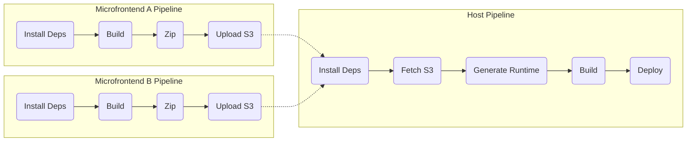
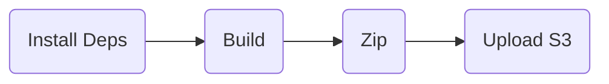
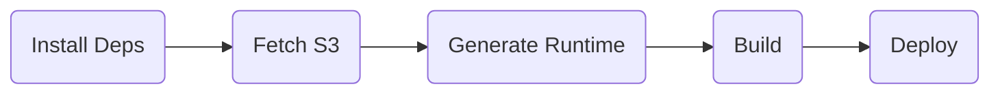

# Shardpack

## Comparativo com Module Federation

- Pros
  - **Builds mais otimizadas**: tree shaking mais eficiente
  - **Runtime mais otimizado**: sem necessidade de carregar nenhum MFE externamente em runtime
  - **Agnóstico a frameworks**: possibilidade de usar qualquer ferramenta de build
    - O plugin pra NextJS do Module Federation só funciona pra o pages router e está obsoleto
- Cons
  - **Pipeline mais complexa**: requer a implementação de triggers da pipeline dos microfrontends para fazer um novo deploy host
  - **Deploys frequentes**: cada deploy de um MFE causaria um novo deploy do host
    - Reinicializações do microserviço do host frequentemente pode ser um problema?
    - Existe a possibilidade de um microfrontend quebrar a aplicação host? Quais são os guardrails necessários pra evitar isso?
- Kept
  - **Independência de escopo**: o host e os microfrontends são independentes, eles não precisam ter vínculo em código
  - **Isolação de dependências**: cada microfrontend pode ter suas próprias bibliotecas, sem conflitos de versionamento entre MFEs
  - **Compartilhamento de dependências**: para dependências que não precisam ou não podem ser duplicadas (como o React, por exemplo)

## Pipeline



### Pipeline de um microfrontend



1. `[Build]` Os MFEs devem fazer uma build no modo library, incluindo no bundle de todas as dependências (exceto as shared)
2. `[Zip]` A pasta "dist" dos MFEs será zipada
3. `[Upload S3]` Esse zip poderá ser salvo no S3
4. O host poderá então ser recompilado com a nova versão do MFE

### Pipeline do host




1. `[Fetch S3]` Baixa e extrai cada um dos MFEs para a pasta modules
   ```
   shardpack/
   └── modules/
       ├── demo-mfe-nav/
       │   └── [...].js
       └── demo-mfe-product/
           └── [...].js
   ```
2. `[Generate Runtime]` Gera um arquivo `runtime.js` que abtrai o carregamento dos remotes. Exemplo:
    ```ts
    const remotes = {
      "demo-mfe-nav/Header": () => import("./modules/demo-mfe-nav/Header.js"),
      "demo-mfe-nav/Footer": () => import("./modules/demo-mfe-nav/Footer.js"),
      "demo-mfe-product/Product": () => import("./modules/demo-mfe-product/Product.js"),
    } as const;
    
    export async function loadRemote(name: string): Promise<any> {
      const loader = remotes[name];
      
      if (loader) {
        return await loader();
      }
      
      throw new Error("Remote not found");
    }
    ```
3. `[Build]` A build do host poderá ser refeita, que irá considerar os arquivos dos MFEs como parte do projeto

## Questionamentos

### Há alguma maneira de atualizar o host sem a necessidade de executar a pipeline?

Qualquer mudança de um MFE precisaria de uma recompilação do host.

Essa recompilação poderia ser feita no próprio microserviço do host por um sidecar, mesmo assim, ainda há a necessidade da reinicialização do processo para que a nova versão vá para o ar.

Há a possibilidade de implementação de um modelo de cluster dentro do microserviço que possibilitaria a reinicialização com zero downtime, como por exemplo utilizando o [PM2 no Cluster Mode](https://nodejs.org/api/cluster.html#how-it-works), que subiria dois processos do servidor para fazer uma atualização blue-green.

Além de implementar uma solução nova, também há a possibilidade de reutilizar a infraestrutura já existente. Por exemplo, um cluster no Kubernetes consegue fazer um [restart progressivo](https://kubernetes.io/docs/reference/kubectl/generated/kubectl_rollout/kubectl_rollout_restart/) dos pods para que a aplicação tenha zero downtime.
Nesse cenário, seria possível fazer a recompilação logo antes da inicialização do servidor, em que seria necessário apenas uma reinicialização nos pods para que os MFEs fossem atualizados no host.

Evitar uma pipeline pode resultar em custos desnecessários. Ao invés de fazer uma única compilação por atualização de um MFE, seriam feitas multiplas recompilações, a depender da quantidade de réplicas e da frequência de reinicializações e eventos de autoscaling.


### Ao invés de utilizar uma esteira CI/CD, poderia ter um microserviço para a recompilação?

Sim. O resultado seria o mesmo, e isso abre o seguinte questionamento: esse microserviço não se tornaria uma ferramenta de CI/CD?

Vale a reflexão do porquê a atual ferramenta de CI/CD não atenderia tão bem quanto um microserviço dedicado:
- É mais complexa a implementação na ferramenta existente?
- Há alguma limitação técnica na ferramenta?
- Os custos são mais altos do que de um microserviço?
- Há alguma barreira na evolução da ferramenta? (exemplo: depende de outro time que tem outras prioridades)
- Existe algum outro fator limitante no uso da ferramenta?

### Existe alguma forma de fazer os MFEs dinâmicos e utilizar de hot-reload para atualizar sem downtime?

Conceitualmente sim. Na prática, não.

O hot reload é utilizado para recompilar e atualizar os recursos sem a necessidade de uma reinicialização.

Por ser dedicado para ambientes de desenvolvimento com o objetivo de garantir a melhor experiência do desenvolvedor, a utilização de recursos é muito mais alta, os bundles não passam por nenhum processamento de otimização e informações de depuração são disponibilizadas client-side. 

Dessa forma, utilizar o hot reload perderia todos os "Pros" listados acima, tornando o Module Federation uma opção mais vantajosa.

