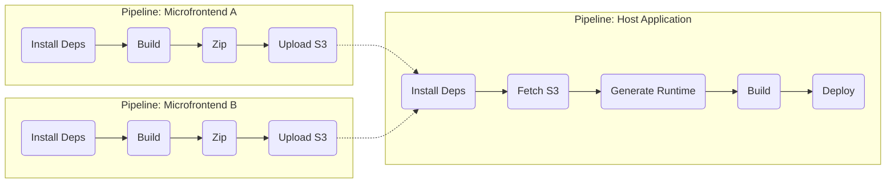
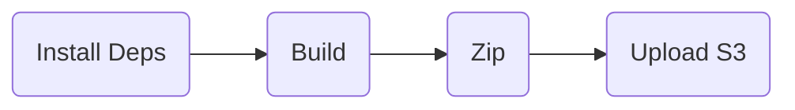
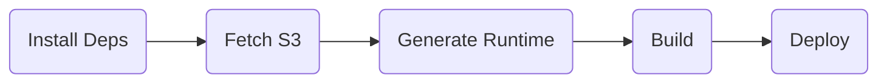

# Shardpack

Proof of concept de uma ferramenta que possibilita a arquitetura de microfrontends.

Carrega todos os microfrontends em build-time, automatizando o processo de instalação e atualização.

O objetivo dessa POC é ser um substituto do [Module Federation](https://module-federation.io/), sem carregar os microfrontends em runtime e depender de compiler plugins para atingir esse resultado. 

## Glossário

- Microfrontend: Um repositório isolado que contém código de componentes do frontend
- MFE: Abreviação para "Microfrontend"
- Host: Aplicação orquestradora que carregará os microfrontends
- Bundles: Arquivos JS gerados pelo compilador, que contém a aplicação inteira de forma otimizada e minificada

## Porque não Module Federation?

O Module Federation tem inúmeros problemas:
- **Request Waterfall**: os MFEs carregam apenas sob demanda, sem a possibilidade de paralelização com o carregamento do host, resultando em uma experiência mais lenta.
- **Uso ineficiente de rede**: como o código dos MFEs precisam estar sempre atualizados, há a necessidade de sempre requisitar a última versão dos MFEs.
- **Alto uso de CPU**: o processo de carregamento dos MFEs de forma dinâmica demanda um alto uso de CPU para interpretação e avaliação do código.
- **Otimizações ineficientes**: como os MFEs são carregados em runtime, eles são uma "caixa-preta" em build-time, não há como saber o que cada um dos microfrontends poderá usar e por isso não há possibilidade de habilitar inúmeras otimizações. (exemplos: DCE, PPR, ISR, RSC, etc)
- **Dependência de frameworks**: o Module Federation depende de plugins próprios para a compilação e carregamento dos microfrontends, e por isso, vários frameworks não funcionam corretamente.
  - Além disso, dos poucos frameworks que são suportados, alguns estão obsoletos. Por exemplo, o plugin para NextJS, que só suporta o Pages Router, está obsoleto.
- **Sem suporte a React Server Components**: o RSC depende de um processo de compilação que impede que os módulos sejam "caixa-preta" em build-time.
- **Sem suporte a outros runtimes**: o Module Federation só suporta web e NodeJS nesse momento, não há suporte para Bun, Deno, React Native e edge.
- **Bundles grandes**: o Module Federation introduz muito código em runtime para gerenciar os módulos dinâmicos e as suas dependências, e esse código é duplicado entre cada um dos microfrontends.

## Como que funciona essa POC?

O Module Federation precisa gerar um bundle em um formato específico, lidar com particularidades de navegadores e do NodeJS para carregar dinamicamente, e gerenciar o versionamento e o compartilhamento de dependências.
Todas essas etapas são de alta complexidade e são necessárias para que o carregamento em runtime seja possível.

E então surge o questionamento: por que gerir os microfrontends em runtime?
A principal vantagem para carregar os microfrontends dinâmicamente é evitar que qualquer atualização de um MFE também dependa da atualização da aplicação host.
É possível atingir o mesmo objetivo sem a complexidade, incompatibilidade e ineficiência do carregamento em runtime?

O modelo de bibliotecas é bem estabelecido no ecossistema, todos os compiladores suportam. É possível fazer o mesma gestão que o Module Federation faz com muito menos esforço. Além de ser totalmente agnóstico de framework, ambiente ou ferramenta de compilação.

Ao transformar todos os microfrontends em bibliotecas, ainda temos um problema: cada um deles teria que ser instalado e registrado individualmente no código do repositório do host.
E cada atualização de um MFE precisaria de uma atualização no host também, que reduziria a autonomia dos MFEs.

Por conta disso, essa POC também visa atualizar e recompilar automaticamente a aplicação host quando um microfrontend for atualizado.

## Comparativo com Module Federation

- Pros
  - **Builds mais otimizadas**: tree shaking mais eficiente
  - **Runtime mais otimizado**: sem necessidade de carregar MFEs externamente
  - **Agnóstico a frameworks**: possibilidade de usar qualquer framework, ambiente e ferramenta de build
  - **SSR facilitado**: não requer nenhuma configuração adicional
- Cons
  - **Pipeline mais complexa**: requer a implementação de triggers da pipeline dos microfrontends para fazer um novo deploy host
  - **Deploys frequentes**: cada deploy de um MFE causaria um novo deploy do host
    - Reinicializações do microserviço do host frequentemente pode ser um problema?
    - Existe a possibilidade de um microfrontend quebrar a aplicação host? Quais são os guardrails necessários pra evitar isso?
- Kept
  - **Independência de escopo**: o host e os microfrontends são independentes, eles não precisam ter vínculo em código
  - **Isolação de dependências**: cada microfrontend pode ter as suas próprias bibliotecas, sem conflitos de versionamento entre MFEs
  - **Compartilhamento de dependências**: para dependências que não precisam ou não podem ser duplicadas (como o React, por exemplo)

## Proposta de Código

O primeiro passo é copiar todos os arquivos gerados pelas builds dos microfrontends para dentro da aplicação host. Vamos supor que a estrutura de pasta fique assim:

```
shardpack/
└── modules/
    ├── demo-mfe-nav/
    │   └── [...].js
    └── demo-mfe-product/
        └── [...].js
```

Agora, precisamos carregar esses arquivos sob demanda. Podemos gerar um código de apoio que mapeia os imports desses arquivos a nomes, por exemplo:

```ts
// remote.js
const remotes = {
  "demo-mfe-nav/Header": () => import("./modules/demo-mfe-nav/Header.js"),
  "demo-mfe-nav/Footer": () => import("./modules/demo-mfe-nav/Footer.js"),
  "demo-mfe-product/Product": () => import("./modules/demo-mfe-product/Product.js"),
};

export async function loadRemote(name: string): Promise<any> {
  const loader = remotes[name];
  
  if (loader) {
    return await loader();
  }
  
  throw new Error("Remote not found");
}
```

Os imports serem estáticos permitem que o compilador saiba que esses arquivos poderão ser carregados, e isso permitiria otimizações.

Não importa se a lista de remotes esteja vazia ou com centenas de itens, a função `loadRemote()` faz o papel da camada de abstração.

## Proposta de Pipeline

Para que o host seja atualizado automaticamente toda vez que um microfrontend for atualizado também, é necessário que a pipeline dos MFEs execute a pipeline do host.



### Pipeline de um microfrontend



1. `[Build]` Os MFEs devem fazer uma build no modo library, incluindo no bundle de todas as dependências (exceto as compartilhadas)
2. `[Zip]` A pasta "dist" dos MFEs deve ser zipada
3. `[Upload S3]` Esse zip deve ser salvo no S3
4. O host deverá então ser recompilado

### Pipeline do host



1. `[Fetch S3]` Baixa e extrai o zip de cada um dos MFEs para a pasta `modules`.
2. `[Generate Runtime]` Gera o arquivo `runtime.js` que abtrai o carregamento dos MFEs.
3. `[Build]` Compila o host, que incluirá os arquivos dos MFEs como parte do projeto.

### Implementações

As primeiras etapas da pipeline de um microfrontend são bem simples de implementar, basta executar comandos comuns:
- Build: `npm run build`
- Zip: [`zip -r dist.zip dist`](https://linux.die.net/man/1/zip)
- Upload S3: [`aws s3 cp dist.zip s3://nome-do-bucket/exemplo/mfe.zip`](https://awscli.amazonaws.com/v2/documentation/api/latest/reference/s3/cp.html)

A maior complexidade na implementação dessa pipeline é o passo de disparar a pipeline do host a partir da pipeline dos MFEs, que pode ser feito de várias maneiras, dependendo da ferramenta de CI/CD utilizada:

- No GitLab CI/CD, é possível criar uma [Multi-project pipeline](https://docs.gitlab.com/ci/pipelines/downstream_pipelines/#multi-project-pipelines).
- No Bitbucket Pipelines, é possível utilizar o [Trigger Pipeline](https://bitbucket.org/product/features/pipelines/integrations?p=atlassian/trigger-pipeline).
- No GitHub Actions, é possível utilizar o trigger `repository_dispatch` em conjunto com uma chamada na API. [Veja](https://github.com/peter-evans/repository-dispatch) [um](https://www.amaysim.technology/blog/using-github-actions-to-trigger-actions-across-repos) [exemplo](https://medium.com/hostspaceng/triggering-workflows-in-another-repository-with-github-actions-4f581f8e0ceb).
- No Jenkins, é possível utilizar o [plugin Build Step](https://plugins.jenkins.io/pipeline-build-step/) ou o [plugin Parameterized Trigger](https://plugins.jenkins.io/parameterized-trigger/) para disparar um job em outro repositório. [Veja outros exemplos](https://www.coachdevops.com/2023/12/how-to-trigger-jenkins-job-from-another.html).
- No Azure DevOps, é possível utilizar a funcionalidade [Resources](https://learn.microsoft.com/en-us/azure/devops/pipelines/process/resources?view=azure-devops#pipeline-resource) para disparar uma pipeline em outro repositório. [Veja um exemplo](https://github.com/HoussemDellai/Trigger-Pipeline-From-Another-Pipeline?tab=readme-ov-file#1-trigger-a-pipeline-from-another-pipeline-using-resources-feature).

Já na pipeline do host, as etapas "Fetch S3" e "Generate Runtime" são implementadas pelo Shardpack, basta apenas executar um comando antes da build.

## Demonstrações

Criei duas demonstrações, uma com a proposta do Shardpack, e outra com o Module Federation. As demos seguem a mesma estrutura, com o código dos componentes iguais, apenas mudando a forma de carregar os MFEs e o método de renderização.

Contém:
- `host`: Aplicação principal, utilizando NextJS
- `mfe-nav`: Microfrontend que contém os componentes de cabeçalho e o rodapé
- `mfe-product`: Microfrontend que contém um componente de detalhes do produto

Para executar, há scripts na pasta `scripts` para instalar as dependências, compilar os repositórios e executá-los:
1. Execute `install.sh` para instalar as dependências
2. Execute `build.sh` para compilar os repositórios
3. Execute `run-[...].sh` para executar a demo que desejar

## Questionamentos

### Há alguma maneira de atualizar o host sem a necessidade de executar a pipeline?

Qualquer mudança de um MFE precisaria de uma recompilação do host.

Essa recompilação poderia ser feita no próprio microserviço do host através de um sidecar, mas mesmo assim, ainda há a necessidade da reinicialização do processo para que a nova versão vá para o ar.

Há a possibilidade de implementação de um modelo de cluster dentro do microserviço que possibilitaria a reinicialização com zero downtime, como por exemplo utilizando o [PM2 no Cluster Mode](https://pm2.keymetrics.io/docs/usage/cluster-mode/#reload), que subiria dois processos do servidor para fazer uma atualização blue-green.

Além de implementar uma solução nova, também há a possibilidade de reutilizar a infraestrutura já existente. Por exemplo, um cluster no Kubernetes consegue fazer um [restart progressivo](https://kubernetes.io/docs/reference/kubectl/generated/kubectl_rollout/kubectl_rollout_restart/) dos pods para que a aplicação tenha zero downtime.
Nesse cenário, seria possível fazer a compilação antes da inicialização do servidor, sendo necessário apenas uma reinicialização nos pods para que os MFEs fossem atualizados no host.

Porém, esses modelos ainda são menos eficientes que implementar uma pipeline CI/CD.
Por exemplo, ao invés de fazer uma única compilação por atualização de um MFE, seriam feitas multiplas recompilações, a depender da quantidade de réplicas, da frequência de reinicializações e da quantidade de eventos de autoscaling do microserviço.


### Existe alguma forma de utilizar o hot-reload para atualizar os MFEs sem downtime?

Conceitualmente sim. Na prática, não.

O hot reload é utilizado para recompilar e atualizar os recursos sem a necessidade de uma reinicialização.

Por ser dedicado para ambientes de desenvolvimento com o objetivo de garantir a melhor experiência para o desenvolvedor, o uso de recursos é muito mais alta, os bundles não passam por nenhum processamento de otimização e ferramentas de depuração estariam expostas.

Dessa forma, utilizar o hot reload perderia todos as vantagens listadas acima, tornando o Module Federation uma opção mais vantajosa.

### Ao invés de utilizar uma esteira CI/CD, poderia ter um microserviço para a recompilação?

Sim. O resultado seria o mesmo, e isso abre o seguinte questionamento: esse microserviço não se tornaria uma ferramenta de CI/CD?

Podem existir motivos em que a atual ferramenta de CI/CD não atenderia tão bem quanto um microserviço dedicado:
- É mais complexa a implementação na ferramenta existente?
- Há alguma limitação técnica na ferramenta?
- Os custos são mais altos do que de um microserviço?
- Há alguma barreira na evolução da ferramenta? (exemplo: depende de outro time que tem outras prioridades)
- Existe algum outro fator limitante no uso da ferramenta?

### Há alguma outra forma de carregar em runtime?

O Module Federation não só contém o código para carregamento em runtime, mas também contém uma camada lógica que consegue isolar dependências, ou compartilhá-las caso necessário.

Toda essa lógica poderia ser replicada de uma forma bem mais simples através de uma compilação dos microfrontends em modo biblioteca.
As dependências compartilhadas poderiam ser geridas através de variáveis globais (IIFE), e a isolação das dependências poderia ser feita através do bundling das mesmas na build dos MFEs.

Então, os próprios MFEs poderiam ser então carregados em variáveis globais (IIFE), e essas acessadas pelo host.

A principal vantagem sobre o Module Federation é que não há necessidade de código adicional para carregar os MFEs e gerir dependências, já que todos serão registrados no escopo global.
Já a principal desvantagem é que você teria que gerir as dependências e o carregamento manualmente.

A otimização é pequena e a complexidade de desenvolvimento é alta, e por isso não é uma solução tão vantajosa quanto fazer o carregamento em build-time.
